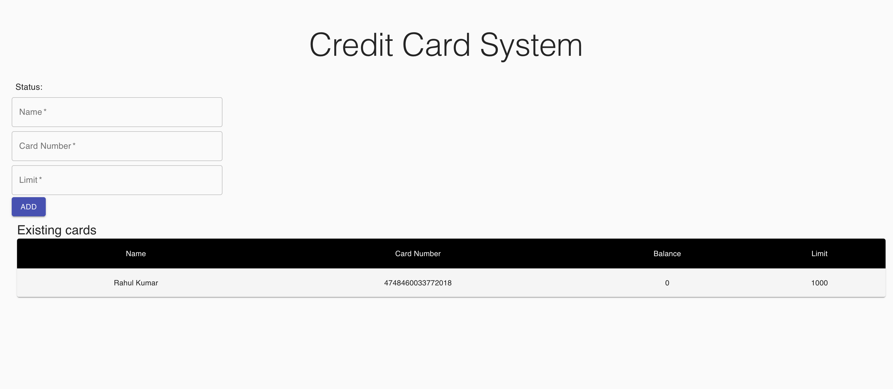

# Getting Started with Credit Card Processing Application

This project created with [Create React App](https://github.com/facebook/create-react-app).

## Prerequisites
* Credit Card Processing application running @ localhost:8080 (Application can be found [here](https://github.com/rahulmzn/credit-card-processing) )

>_NOTE:_ By Default application io configured to access API's on port, in-case backend API's are running on different port then 
it must be updated package.json file for proxy property
>
## How to RUN
In the project directory, you can run:

### `npm install`
### `npm start`

Runs the app in the development mode.\
Open [http://localhost:3000](http://localhost:3000) to view it in the browser.

The page will reload if you make edits.\
You will also see any lint errors in the console.

### Sample view

